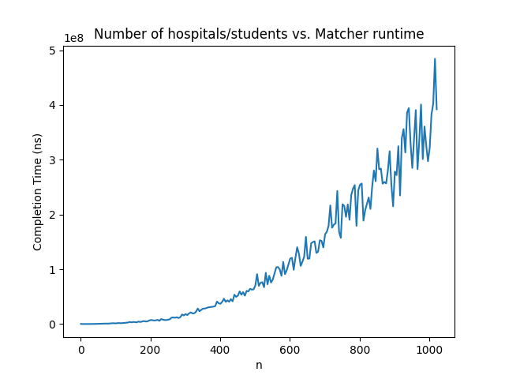
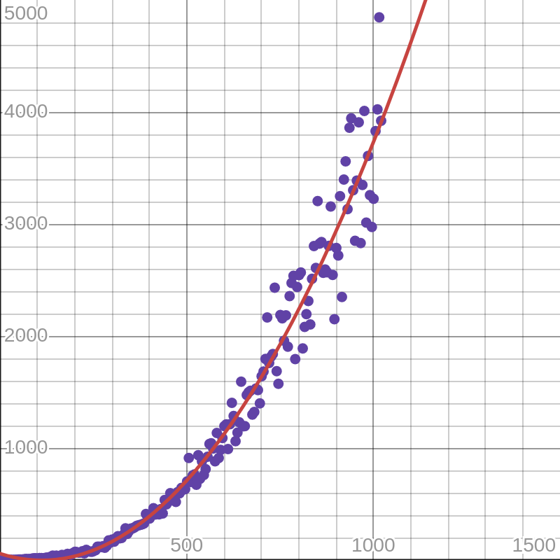
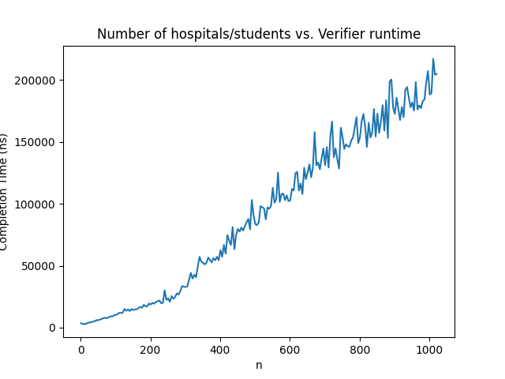
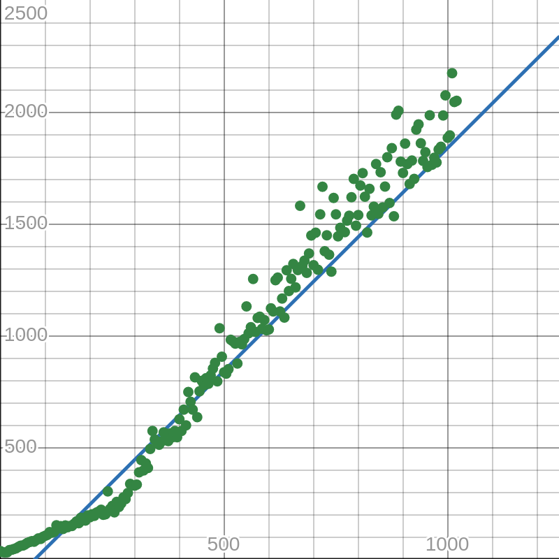
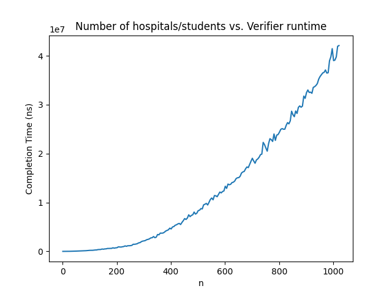
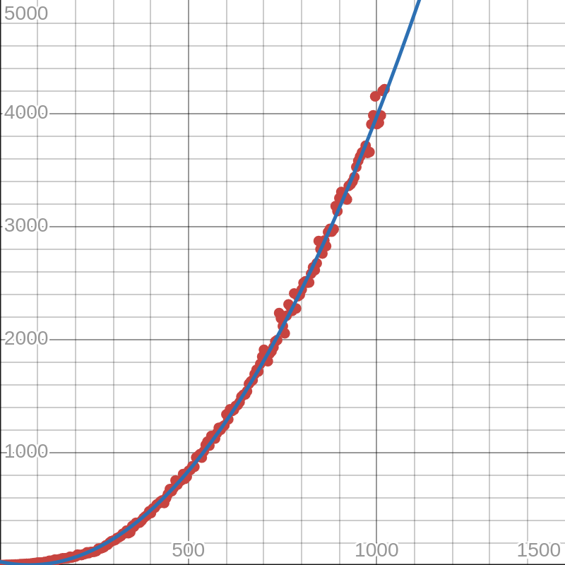

# COP 4533 Assignment 1

**Names:**  
Julian Dominguez (Seedname) - 80849534  
Alex Milanes (Alex42006) - 51506411  

## Usage

Running this program requires Python 3.14.

To run the matcher, use the command
```sh
python src/matcher.py
```  

Change the input file by updating the `file_name` variable on line `119`. Do not include the path to the file, nor the `.in` extension.  


To run the verifier, use the command
```sh
python src/verifier.py
```  

Change the input/output file by updating the `file_name` variable on line `112`. Do not include the path to the file, nor the extension. The input and output file must have the same name. Input files must have a `.in` extension, and output files must have a `.out` extension.


In order to use the analyzer (not part of the required programs for the assignment), dependencies must be first installed with
```sh
pip install -r requirements.txt
```

Then run the program with
```sh
python src/analyzer.py
```

Analyzer output graphs and data is put in the `data/` directory.

### Creating custom inputs

Define an input file in the `inputs/` directory. Input files must be in the format `[name].in`.  

Example input file `inputs/test.in`:
```
4
2 1 4 3
2 3 1 4
4 2 1 3 
4 3 2 1
2 3 4 1 
3 1 4 2
3 2 1 4 
2 3 4 1
```  

The first line contains the number of students/hospitals, n, which is 4 in this case. The next n lines are the preference lists for the hospitals in order from top to bottom, left to right. The next n lines are the students' preference lists, ordered the same way. 

Here is a mapping for clarity, with hospitals `a, b, c, d` and students `w, x, y, z`:  

```
Hospitals
a: x w z y
b: x y w z
c: z x w y
d: z y x w

Students
w: b c d a
x: c a d b
y: c b a d
z: b c d a
```

### Creating custom outputs

Define an output file in the `outputs/` directory. Output files must be in the format `[name].out`.  

Example output file `outputs/test.out`:
```
1 2
2 3
3 4
4 1
```

The file has n lines, where n is the number of students/hospitals (4 in this case). Each line contains a hospital-student match, with the hospital on the left and the student on the right.

Here is a mapping for clarity, with hospitals `a, b, c, d` and students `w, x, y, z`:  
```
Matches
a - x
b - y
c - z
d - w
```

## Scalability

We created `analyzer.py` to automatically create random preference lists and matchings, then time the matcher and analyzer and plot the results.

The following graph shows the completion time of the matcher with randomized preference lists, averaged over `10` iterations, with `n = 1, 6, 11, 16, ..., 1021`. 



The matcher can be fit with a quadratic curve, which suggests that its average time complexity scales by n<sup>2</sup>. This is consistent with the expected time complexity of the Gale-Shapley algorithm. 



The following graph shows the completion time of the verifier with randomized matches, averaged over `10` iterations, with `n = 1, 6, 11, 16, ..., 1021`.  



It can be approximately fit with a linear curve, which suggests that the average time complexity scales by n.




However, this changes when the input to the verifier is the `VALID STABLE` output of the matcher function.



In this case, the verifier runtime can be fit fairly accurately to a quadratic curve, which suggests an average time complexity that scales by n<sup>2</sup> when given stable matches.



It appears that when matches are randomized, the verifier finishes significantly faster. This may be due to the fact that randomized matches are not likely to be stable or near-stable, meaning the program ends early as soon as it detects a conflict. When the verifier is run on a valid and stable solution though, it is forced to check the entire hospital list, leading to the expected scale of n<sup>2</sup>.